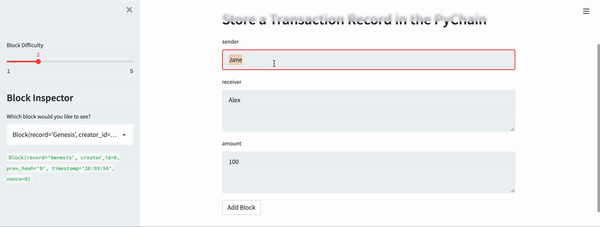

# PyChain Ledger

I'm a fintech engineer who’s working at one of the five largest banks in the world. You were recently promoted to act as the lead developer on their decentralized finance team. Your task is to build a blockchain-based ledger system, complete with a user-friendly web interface. This ledger should allow partner banks to conduct financial transactions (that is, to transfer money between senders and receivers) and to verify the integrity of the data in the ledger.

## Pychain Interface

I created a streamlit interface for Pychain Ledger. Below is the screenshot from the application. Here I test the ledger by inputing sender, receiver and amount information. I also verify the block contents and hashes in the Streamlit dropdown menu. 

At the end, I validated the ledger, and got **True** value.
